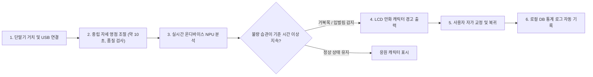

# [PRD] 거북목 & 입벌림 AI 코치 (Neck & Mouth AI Coach)

> **문서 메타데이터**
> - **프로젝트 명**: 거북목 & 입벌림 AI 코치 (Neck & Mouth AI Coach / Desk Posture Coach)
> - **버전**: v1.1.0 (시제품 개발 기준 수정안)
> - **작성일**: 2026-10-06 (최초) / 2026-10-07 (v1.1.0 수정)
> - **상태**: v1.1.0 초안 (검토 필요)

---

## 1. 문제 정의 (Problem Statement)

### 1.1 현재 문제
현대 사무직 종사자 및 학생들은 컴퓨터 화면을 장시간 집중하여 볼 때 무의식적으로 고개를 앞으로 숙이는 **거북목(Forward Head Posture)** 상태를 취하거나, **구강 호흡으로 인해 입을 벌리는 습관**을 지속하게 됩니다.  
이는 경추 추간판 탈출증, 목·어깨 만성 통증, 턱관절 장애, 집중력 저하 및 안면 윤곽 변화 등 심각한 신체적·생리적 문제를 유발합니다.

### 1.2 기존 방식의 한계
- **정기적 타이머/알람 앱**: 사용자 실제 신체 상태와 관계없이 고정된 시간에 작동하므로 실제 불량 자세 발생 순간을 교정하지 못합니다.
- **착용형(Wearable) 교정 센서**: 목이나 어깨에 장비를 직접 부착해야 하여 이물감 및 착용 피로도가 크며, 입벌림 현상은 감지할 수 없습니다.
- **PC 소프트웨어형 웹캠 분석**: PC의 CPU/GPU 자원을 크게 점유하고, 사용자 영상이 소프트웨어를 타고 외부나 메모리에 노출되어 **프라이버시 침해 우려**가 큽니다.

### 1.3 핵심 가치
사용자의 신체에 아무것도 부착하지 않는 **비침습적(Non-intrusive) 온디바이스 에지 AI**를 통해, 거북목과 입벌림 두 가지 불량 습관에만 집중하여 실시간 감지 및 직관적인 시각 피드백(만화 캐릭터)을 제공합니다.

### 1.4 AI 도입의 필요성
조명 환경, 사용자의 얼굴 각도 회전, 안경 착용 여부 등 다양한 환경 변화 속에서도 정면 영상의 얼굴·어깨 랜드마크로 거북목(개인 기준 대비 변화)과 구강 개폐 비(Mouth Aspect Ratio, MAR)를 정확히 판별하기 위해서는 단순 정적 알고리즘이 아닌 **실시간 경량 랜드마크 추출 모델과 개인 기준 대비 판정 로직**이 필수적입니다.

---

## 2. 사용자 시나리오 (User Scenario)

1. **설치 및 위치 잡기**: 사용자가 제품을 모니터 상단에 두고 USB 케이블을 PC에 연결합니다. PC에 자동으로 실행되는 설치 가이드 프로그램이 카메라 화각 내에 사용자 상반신과 얼굴이 정상적으로 위치하도록 안내합니다. 설치 가이드는 얼굴 위치, 정면 정도(yaw), 어깨 가시성이 **허용 설치 범위**(5.4) 안인지 검증하며, 벗어나면 캘리브레이션을 진행하지 않고 위치 재조정을 안내합니다.
2. **데이터 수집 및 초기가이드**: 사용자가 전용 튜토리얼을 진행하며 카운트다운(약 3초) 후 바른 자세와 입을 다문 상태를 약 10초간 유지합니다. 선택적으로 입을 의도적으로 살짝 벌린 상태를 3~5초 추가로 촬영해 개인별 입벌림 임계값을 정합니다. AI는 중립(Neutral) 자세 시의 얼굴·어깨 특징값과 입 닫힘 기준 데이터를 수집하며, 움직임이 크거나 유효 표본이 부족하면 **재촬영을 요청**합니다. 이 기준은 사용 중 자동 갱신하지 않고, 사용자가 명시적으로 재캘리브레이션할 때만 갱신합니다.
3. **실시간 Edge AI 분석**: 제품 내부의 에지 AI 센서가 RGB 영상 스트림을 프레임 단위로 수집하고, 온디바이스 NPU를 통해 얼굴 랜드마크 및 상반신 포즈 관절 좌표를 실시간 추출합니다.
4. **판단 결과 생성**:
   - **거북목 감지**: 정면 영상의 간접 신호(얼굴폭/어깨폭 비율, 턱-어깨선 간격, 머리 pitch, 얼굴 크기 변화)를 조합한 **개인 기준 대비 편차**가 임계값을 넘은 상태가 기준 시간 이상 지속되는지 판단합니다. 기준 시간은 시작값 30초이며 사용자에 따라 30초~3분 범위에서 조정합니다. 절대 경추 각도(CVA)를 직접 측정하지는 않습니다.
   - **입벌림 감지**: 입술 상하 거리와 좌우 거리의 비율(MAR)을 산출하여 개인 임계값 이상의 상태가 기준 시간(시작값 8초) 이상 지속되었는지 판단합니다. 말하기 등 짧은 주기의 개폐 반복은 정상 입 움직임으로 제외합니다.
   - **판정 보류**: 손·컵 등으로 가려졌거나, 얼굴이 정면 허용 범위를 벗어났거나, 영상 품질(과어두움·과밝음·흐림)이 불량한 구간은 오판정 대신 판정을 보류합니다.
   - 위 기준 시간과 임계값은 시작값이며 PoC 및 사용자 테스트로 확정합니다.
5. **디바이스 제어 및 알림**: 불량 습관이 판정되면 디바이스 전면에 탑재된 LCD 디스플레이에 입을 벌리고 있는 만화 캐릭터 또는 목을 길게 빼고 있는 만화 캐릭터 그래픽을 즉시 출력합니다.
6. **후속 행동 및 기록**: 사용자가 디스플레이의 경고 캐릭터를 확인하고 고개를 집어넣거나 입을 다뭅니다. 바른 자세로 복귀하면 디스플레이가 정상 응원 그래픽으로 전환되며, 횟수 및 불량 유지 시간 로그가 PC 컴패니언 앱 로컬 DB에 자동 기록됩니다.
7. **개인 적응 및 알림 조절**: 사용 중 개인 환경에 맞춰 다음 항목만 적응합니다. 모델 재학습이 아니라 통계 갱신 수준입니다.
   - 입 다문 상태의 MAR 분포와 발화 패턴 통계 갱신
   - 사용자 피드백(오탐 신고, 알림 후 반응 패턴)에 따른 민감도·기준 시간 조정 (허용 범위 안에서만)
   - 조명 변화나 카메라 위치 이동이 감지되면 재캘리브레이션 **제안**
   - **기준 자세는 자동으로 갱신하지 않습니다.** 습관화된 나쁜 자세를 정상으로 학습하는 것을 방지하기 위함입니다.
   - 알림이 반복되어 피로를 유발하지 않도록 쿨다운, 스누즈, 일일 알림 상한을 둡니다 (수치는 사용자 테스트로 결정).

---

## 3. 성공 지표 (Success Metrics)

| 지표명 | 목표 수치 | 세부 기준 |
| :--- | :--- | :--- |
| **거북목 감지 정확도 (Precision/Recall)** | **≥ 95%** | 이벤트 단위(알림 1회 = 1건), 정면 설치 기준(허용 설치 범위 내). 정답은 측면 보조 카메라로 측정한 CVA 기반 |
| **입벌림 감지 정확도 (Precision/Recall)** | **≥ 93%** | 이벤트 단위. 정답은 입술 내측 간격 라벨(입 너비 대비 비율과 지속시간, 수치는 PoC에서 정의). 발화·하품·식사의 처리 규칙을 사전 정의 |
| **추론 및 알림 지연 시간 (Latency)** | **≤ 100ms** | 판정 조건 충족이 확정된 시점부터 LCD 피드백 전환까지 (판정 지속시간과 별개) |
| **오탐율 (False Positive Rate)** | **≤ 3%** | 알림 이벤트 중 오알림 비율. 음료 섭취, 대화, 손 가림 등 정상 행동 구간을 포함해 평가하며, 시간당 오알림 상한은 별도 정의(TBD) |
| **사용자 행동 전환율 (Action Compliance)** | **≥ 80%** | 알림 발생 후 5초 이내 바른 자세 복귀 비율 |
| **온디바이스 시스템 연속 가동 안정성** | **프레임 드랍률 ≤ 1%** | 8시간 연속 가동 기준 |

**지표 적용 원칙**

- 위 수치는 **제품(양산) 목표**입니다. 시제품(5.3)의 1차 목표는 수치 달성이 아니라 **지표를 측정할 수 있는 평가 체계를 갖추는 것**입니다.
- 정확도 지표는 정답 데이터(측면 카메라 CVA, 입술 간격 라벨)가 있어야 측정할 수 있으므로, 평가용 데이터 수집 방법을 PoC에서 함께 정합니다.
- 평가 데이터는 습관이 있는 사용자를 포함하고 조명 조건을 다양하게 구성합니다. 규모는 이벤트 약 300건 이상을 목표로 합니다. (실제 정확도 97%일 때 정규 근사 기준으로 95% 신뢰하한을 확인할 수 있는 규모이며 추정치입니다. 확정은 평가 설계 시 재계산합니다.)

---

## 4. 기술 스택 (Technology Stack)

| 구성 요소 | 사용 기술 | 선정 이유 |
| :--- | :--- | :--- |
| **카메라 (Camera)** | 1080p 이상 RGB 센서 카메라 모듈 (저조도에 강한 Sony IMX 계열 우선), 수평 화각 약 70~78°의 왜곡이 적은 렌즈, 720p@30fps 이상으로 운용 | 사용 거리 50~80cm에서 어깨와 얼굴 ROI(모델 입력 192px 이상)를 모두 확보하기 위한 조건입니다. 구체적인 제품은 하드웨어 사양서에서 정의합니다. |
| **MCU / SoC** | **요구 조건**: INT8 NPU, 카메라 입력, USB 디바이스 모드(UVC + HID), 리눅스 + RKNN 계열 툴체인 지원. 시제품은 RK3566급 SBC로 알고리즘을 검증하고, 양산 후보 SoC(RV1126B, RV1106G3 등)는 PoC 결과로 결정 | 카탈로그 TOPS와 실제 성능은 다르므로 목표 모델의 **실측 지연**으로 판단합니다. RV1106는 G2(0.5 TOPS, 128MB)와 G3(1 TOPS, 256MB)의 사양이 다르고 RKNN-Toolkit2의 지원도 제한적이라 우선 후보로 고정하지 않습니다. |
| **디스플레이 (Display)** | 2.0인치 IPS TFT-LCD (320×240, SPI) | 시야각이 넓어 책상 위 어느 각도에서도 만화 피드백 캐릭터를 명확히 식별 가능 |
| **Edge AI Framework** | RKNN-Toolkit2 / RKNN Runtime (INT8 Quantization) | 선정 SoC가 해당 툴체인을 지원해야 합니다 (구형 칩은 구형 툴체인을 쓰는지 확인). TFLite Micro는 MCU용이라 제외합니다. 추론 주기는 시작값으로 포즈 3~5fps, 얼굴·입 랜드마크 10~15fps이며 실측으로 조정합니다. |
| **AI 모델 (Model)** | 경량 포즈 모델(어깨 등 상반신 점) + 경량 얼굴 랜드마크 모델(**입술 내측 점 필수**). 후보 예: RTMPose 계열, PFLD 계열 (PoC로 선정) | 선정 기준은 정확도 우선입니다. 목표 환경에서의 점 지터·편향과 INT8 변환 후 오차를 먼저 평가하고, 지연 ≤100ms와 연산 예산을 만족하는 모델 중 가장 정확한 것을 선택합니다. |
| **통신 프로토콜** | USB 2.0 (UVC + HID Composite) | 별도 드라이버 설치 없이 플러그앤플레이 지원 및 가이드 SW와 데이터 고속 송수신. 구현 가능성은 양산 단계에서 검증하며 시제품(5.3)에서는 제외합니다. |
| **PC 가이드/설치 앱** | Electron (TypeScript) / C++ Native | Windows 및 macOS 크로스 플랫폼 지원 및 미려한 캘리브레이션 UX 제공 |
| **데이터베이스** | SQLite (PC Local Companion App) | 사용자 포즈 통계 데이터의 외부 유출 방지(프라이버시 100%) 및 로컬 저장소 기반의 고속 조회. 시제품은 컴패니언 앱 대신 보드 로컬 DB에 기록합니다(5.3). |
| **대시보드** | React / Chart.js | 일/주/월별 거북목 및 입벌림 유발 빈도를 직관적인 그래프로 시각화 |

---

## 5. 개발 범위 (Scope)

### 5.1 개발 범위 (In Scope)
1. **실시간 거북목 감지**: 정면 영상의 얼굴·어깨 랜드마크로 얻는 간접 신호(얼굴폭/어깨폭 비율, 턱-어깨선 간격, 머리 pitch, 얼굴 크기 변화)를 조합해 **개인 기준 대비 변화량**을 판정 (절대 경추 각도 측정은 범위 외)
2. **실시간 입벌림 감지**: 얼굴 랜드마크 기반 구강 개폐 비율(Mouth Aspect Ratio, MAR) 산출 및 감지 (개인별 임계값 적용, 발화·가림 구간 제외)
3. **온디바이스 LCD 그래픽 제어**: 감지된 자세 상태(정상/거북목/입벌림)에 따른 실시간 만화 캐릭터 피드백 출력
4. **PC 설치 가이드 및 캘리브레이션 앱**: 허용 설치 범위 검증, 중립 자세 영점 조절(품질 검사 및 재촬영), 튜토리얼 가이드 프로그램 개발
5. **USB HID/UVC 복합 통신**: PC와 단말기 간의 설정값 전달 및 포즈 상태 로그 송수신 파이프라인 구축
6. **로컬 데이터 저장 및 대시보드**: 개인 프라이버시를 보장하는 로컬 DB 연동 및 사용자 통계 리포트 화면 제공
7. **환경 보정**: 카메라 자동노출 설정(캘리브레이션 후 완만화 또는 고정 검토)과 프레임 품질 게이트(과어두움·과밝음·흐림 시 판정 보류). CLAHE·감마·롤 정렬 등 이미지 보정은 효과가 입증된 경우에만 도입합니다.
8. **개인 적응**: 입 임계값·발화 패턴 통계 갱신, 사용자 피드백 기반 민감도 조정, 재캘리브레이션 제안 (기준 자세 자동 갱신 제외). 피드백 입력은 PC 컴패니언 앱을 경유합니다. (시제품은 통계 갱신만 적용, 5.3 참조)
9. **알림 피로 방지**: 쿨다운, 스누즈, 일일 알림 상한 (수치는 사용자 테스트로 결정)

### 5.2 개발 제외 범위 (Out of Scope)
- **음성 인식 및 음성 알림 기능**: 마이크/스피커를 활용한 음성 기반 교정 안내 기능 제외 (시각 피드백 중심)
- **모바일 앱(iOS/Android) 개발**: PC 데스크 환경에만 집중하며 스마트폰 연동 기능은 제외
- **클라우드 서버 연동 및 AI 추론**: 모든 비디오 처리 및 추론은 100% 디바이스 내부에서 완결 (No Cloud)
- **기타 전신 자세 교정**: 허리 구부림, 골반 틀어짐, 어깨 불균형 등 목과 입 이외의 관절 추적 제외
- **다국어 지원 및 기업용 멀티 계정**: 단일 사용자 전용 PC 컴패니언 소프트웨어로 제한
- **무선 통신 및 배터리 시스템**: Bluetooth/Wi-Fi 모듈 및 내장 배터리 제외 (USB 전원 및 데이터 유선 연결 전용)
- **절대 경추 각도(CVA) 직접 측정 및 측면 설치 전용 모드**: 정면 설치를 전제로 하며, 거북목은 개인 기준 대비 변화량으로 판정
- **사용 중 기준 자세 자동 갱신**: 기준 자세는 사용자가 명시적으로 재캘리브레이션할 때만 갱신
- **마스크·모자 착용, 역광 창문 환경 지원**: 지원 범위 밖이며 품질 게이트나 판정 보류로 처리

### 5.3 시제품(1차) 범위

- **목적**: 알고리즘, 사용자 경험, 폼팩터를 한 번 직접 만들어 검증합니다.
- **포함**: 개발 보드 + 카메라 + 디스플레이(초기에는 외부 모니터 사용 가능, 이후 소형 LCD)로 온디바이스 추론, 캐릭터 피드백, 보드 로컬 DB 로그, 3D 프린트 케이스(자체 제작)
- **제외**: UVC + HID 복합 장치, PC 컴패니언 앱 및 대시보드, 피드백 기반 민감도 조정(컴패니언 앱이 필요), 8시간 가동 안정성과 제품 목표 수치(95% 등) 달성
- **개인 적응 범위**: 시제품은 입 다문 상태의 MAR 분포와 발화 패턴의 **통계 갱신**에 한정합니다. 기준 자세 자동 갱신 금지는 동일하게 적용합니다.
- **1차 목표**
  - 정면 간접 신호와 측면 CVA의 상관 확인 (측면 보조 카메라 동기 촬영)
  - 3장 지표를 측정할 수 있는 평가 체계 구축
  - 후보 모델 비교 (FP32 정확도 → INT8 변환 후 정확도, 목표 보드 지연 실측)
- **개발 단계(참고)**: M1 PC에서 기준 출력 모델로 특징과 판정 로직 검증 → M2 개발 보드로 경량 모델 이식 및 비교 → M3 LCD, 로그, 개인 적응(통계 갱신 한정) → M4(선택) 양산 후보 SoC 이식 및 UVC/HID 검증

### 5.4 전제 및 한계 (사용 조건)

| 항목 | 기준 | 비고 |
| :--- | :--- | :--- |
| **사용자** | 단일 사용자 | 5.2와 동일 |
| **설치 위치** | 모니터 상단 중앙, 카메라 높이는 눈높이 이상 | 책상 위 거치는 카메라가 눈보다 낮아져 신호의 부호가 달라질 수 있으므로 별도 검증 전까지 지원 범위에서 제외 |
| **사용 거리** | 50~80cm | **가정값**입니다. 현장 확인이 필요합니다. |
| **얼굴 정면 정도** | 정면 ±30° 이내 (시작값) | 약간 측면으로 설치된 경우의 정적 오프셋은 캘리브레이션이 흡수하고, 허용 범위를 넘으면 재설치를 안내합니다. 사용 중 허용 범위를 넘으면 판정을 보류합니다. |
| **가림** | 손, 컵 등으로 가려지면 판정 보류 | 오탐 방지 |
| **비지원 환경** | 마스크, 모자, 역광 창문 | 5.2 참조 |
| **판정 방식** | 개인 기준 대비 변화 | 정면 간접 신호이므로 절대 각도가 아님 |

---

## 6. ROI 분석 및 비즈니스 가치 (Business Value)

> **분석 기준**: 가상의 B2B 기업 (사무직 임직원 100명 규모 조직) 도입 기준

| 구분 | 금액 (원) | 세부 내역 및 산출 근거 (가정) |
| :--- | :--- | :--- |
| **초기 투자비 (CAPEX)** | **20,000,000** | H/W 단말기 100대 × 120,000원 + SW 커스터마이징 8,000,000원 |
| **월 절감액 (Gross Benefit)** | **5,000,000** | 1인당 월 50,000원 상당의 몰입도/생산성 향상 × 100명 |
| **월 운영비 (OPEX)** | **500,000** | 단말기 전력비 100,000원 + 유지보수 공수 400,000원 |
| **월 순 절감액 (Net Benefit)** | **4,500,000** | 월 절감액 - 월 운영비 |
| **연간 순 절감액** | **54,000,000** | 월 순 절감액 × 12개월 |
| **연간 ROI (%)** | **270%** | (연간 순 절감액 / 초기 투자비) × 100 |
| **투자 회수 기간 (Payback)** | **약 4.4개월** | 초기 투자비 / 월 순 절감액 |

### 6.1 최종 판정 결과
100인 사무 조직 기준 도입 시 초기 투자금 2,000만 원은 **약 4.4개월 이내에 전액 회수**되며, **연간 270%의 높은 투자 대비 수익률(ROI)**을 달성합니다.  
경추 질환 및 구강 건조로 인한 임직원의 병가 발생률 감소 및 업무 집중도 향상 효과를 고려할 때, 본 제품은 비침습적이고 프라이버시 위험이 없는 경제적인 피지컬 AI 솔루션으로서 신속한 투자 승인이 타당합니다.

---

## 7. 미결 사항 및 검증 항목 (Open Issues)

| 우선순위 | 항목 | 비고 |
| :--- | :--- | :--- |
| 🔴 | **정면 간접 신호와 측면 CVA의 상관 검증** | 실패 시 5.1의 거북목 판정 방식을 재정의해야 합니다. |
| 🔴 | 후보 모델의 INT8 변환 가능 여부와 정확도 (점 지터, 편향, FP32 대비 오차) | 입술 내측 점 정확도가 입벌림 지표를 좌우합니다. |
| 🔴 | 목표 SoC에서의 실제 NPU 성능과 연산 예산 실측 | 포즈 3~5fps, 얼굴 10~15fps 가정의 검증 |
| 🟠 | 사용 거리·카메라 높이·화각 현장 확인 | 현재 50~80cm는 가정이며 현장 조사표도 미작성 상태입니다. |
| 🟠 | 거북목·입벌림 판정 기준 시간 및 임계값 수치 확정, 알림 피로 파라미터 | 시작값은 2장 참조 |
| 🟠 | 평가 데이터 규모와 구성 (습관 있는 사용자 포함) | 3장 원칙 참조 |
| 🟡 | UVC + HID 복합 장치 구현 가능성 | 시제품에서 제외, 양산 단계 검증 |
| 🟡 | UVC로 영상이 PC에 전달되는 구조에서의 프라이버시 주장(1.2) 충족 방안 | 영상 접근 제한 설계 필요 |
| 🟡 | 지연 ≤100ms의 정의 합의 | 3장은 "판정 확정 후 LCD 전환"으로 정의했습니다. |

---

## 8. 버전 변경 이력 (Changelog)

| 버전 | 날짜 | 작성자/수정자 | 변경 내용 요약 |
| :--- | :--- | :--- | :--- |
| **v1.0.0** | 2026-10-06 | 프로젝트 팀 | docx 원본 기반 최초 마크다운 PRD 문서화 완료 |
| **v1.1.0** | 2026-10-07 | 프로젝트 팀 (초안 작성 보조: Claude) | 시제품 개발 기준으로 수정: ① 거북목 판정을 정면 간접 신호 기반 개인 기준 대비 변화로 재정의 ② 캘리브레이션을 약 10초와 품질 검사로 변경 ③ 판정 시간을 행동별 시작값으로 변경(거북목 30초, 입벌림 8초) ④ 개인 적응 범위와 알림 피로 방지 추가 ⑤ 성공 지표를 이벤트 단위로 정의하고 평가 원칙 추가 ⑥ 기술 스택을 요구 조건 중심으로 수정(SoC 고정 해제, TFLite Micro 제거, 모델 선정 기준 명시) ⑦ 시제품 범위(5.3)와 전제·한계(5.4) 신설 ⑧ 미결 사항(7장) 신설 ⑨ 시제품의 개인 적응을 통계 갱신으로 한정하고 설치 위치 문구를 모니터 상단으로 정합화 |
