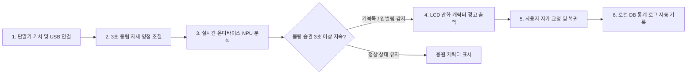

# [PRD] 거북목 & 입벌림 AI 코치 (Neck & Mouth AI Coach)

> **문서 메타데이터**
> - **프로젝트 명**: 거북목 & 입벌림 AI 코치 (Neck & Mouth AI Coach / Desk Posture Coach)
> - **버전**: v1.0.0 (최초 작성 버전)
> - **작성일**: 2026-10-06
> - **상태**: 승인 / 개발 준비 완료

---

## 1. 문제 정의 (Problem Statement)

### 1.1 현재 문제
현대 사무직 종사자 및 학생들은 컴퓨터 화면을 장시간 집중하여 볼 때 무의식적으로 고개를 앞으로 숙이는 **거북목(Forward Head Posture)** 상태를 취하거나, **구강 호흡으로 인해 입을 벌리는 습관**을 지속하게 됩니다.  
이는 경추 추간판 탈출증, 목·어깨 만성 통증, 턱관절 장애, 집중력 저하 및 안면 윤곽 변화 등 심각한 신체적·생리적 문제를 유발합니다.

### 1.2 기존 방식의 한계
- **정기적 타이머/알람 앱**: 사용자 실제 신체 상태와 관계없이 고정된 시간에 작동하므로 실제 불량 자세 발생 순간을 교정하지 못합니다.
- **착용형(Wearable) 교정 센서**: 목이나 어깨에 장비를 직접 부착해야 하여 이물감 및 착용 피로도가 크며, 입벌림 현상은 감지할 수 없습니다.
- **PC 소프트웨어형 웹캠 분석**: PC의 CPU/GPU 자원을 크게 점유하고, 사용자 영상이 소프트웨어를 타고 외부나 메모리에 노출되어 **프라이버시 침해 우려**가 큽니다.

### 1.3 핵심 가치
사용자의 신체에 아무것도 부착하지 않는 **비침습적(Non-intrusive) 온디바이스 에지 AI**를 통해, 거북목과 입벌림 두 가지 불량 습관에만 집중하여 실시간 감지 및 직관적인 시각 피드백(만화 캐릭터)을 제공합니다.

### 1.4 AI 도입의 필요성
조명 환경, 사용자의 얼굴 각도 회전, 안경 착용 여부 등 다양한 환경 변화 속에서도 경추 각도 및 구강 개폐 비(Mouth Aspect Ratio, MAR)를 정확히 판별하기 위해서는 단순 정적 알고리즘이 아닌 **실시간 3D 랜드마크 추출 및 머신러닝 기반 경량 분류 모델**이 필수적입니다.

---

## 2. 사용자 시나리오 (User Scenario)

1. **설치 및 위치 잡기**: 사용자가 제품을 모니터 상단 또는 책상 위에 두고 USB 케이블을 PC에 연결합니다. PC에 자동으로 실행되는 설치 가이드 프로그램이 카메라 화각 내에 사용자 상반신과 얼굴이 정상적으로 위치하도록 안내합니다.
2. **데이터 수집 및 초기가이드**: 사용자가 전용 튜토리얼을 진행하며 바른 자세를 3초간 유지합니다. AI는 사용자의 중립(Neutral) 자세 시의 경추 각도와 입 닫힘 상태의 기준 데이터를 수집합니다.
3. **실시간 Edge AI 분석**: 제품 내부의 에지 AI 센서가 RGB 영상 스트림을 프레임 단위로 수집하고, 온디바이스 NPU를 통해 얼굴 랜드마크 및 상반신 포즈 관절 좌표를 실시간 추출합니다.
4. **판단 결과 생성**:
   - **거북목 감지**: 귀(이개) 위치가 어깨 중심선 대비 전방으로 기준 임계값(예: 15° 이상)을 3초 이상 넘어섰는지 판단합니다.
   - **입벌림 감지**: 입술 상하 거리와 좌우 거리의 비율(MAR)을 산출하여 입벌림 상태가 3초 이상 지속되었는지 판단합니다.
5. **디바이스 제어 및 알림**: 불량 습관이 판정되면 디바이스 전면에 탑재된 LCD 디스플레이에 입을 벌리고 있는 만화 캐릭터 또는 목을 길게 빼고 있는 만화 캐릭터 그래픽을 즉시 출력합니다.
6. **후속 행동 및 기록**: 사용자가 디스플레이의 경고 캐릭터를 확인하고 고개를 집어넣거나 입을 다뭅니다. 바른 자세로 복귀하면 디스플레이가 정상 응원 그래픽으로 전환되며, 횟수 및 불량 유지 시간 로그가 PC 컴패니언 앱 로컬 DB에 자동 기록됩니다.

---

## 3. 성공 지표 (Success Metrics)

| 지표명 | 목표 수치 | 세부 기준 |
| :--- | :--- | :--- |
| **거북목 감지 정확도 (Precision/Recall)** | **≥ 95%** | 정사각 및 사각 측면 구도 기준 |
| **입벌림 감지 정확도 (Precision/Recall)** | **≥ 93%** | 입술 미세 개폐 기준 |
| **추론 및 알림 지연 시간 (Latency)** | **≤ 100ms** | 동영상 수집부터 LCD 피드백 전환까지 |
| **오탐율 (False Positive Rate)** | **≤ 3%** | 음료 섭취 및 대화 동작 구분 |
| **사용자 행동 전환율 (Action Compliance)** | **≥ 80%** | 알림 발생 후 5초 이내 바른 자세 복귀 비율 |
| **온디바이스 시스템 연속 가동 안정성** | **프레임 드랍률 ≤ 1%** | 8시간 연속 가동 기준 |

---

## 4. 기술 스택 (Technology Stack)

| 구성 요소 | 사용 기술 | 선정 이유 |
| :--- | :--- | :--- |
| **카메라 (Camera)** | 1080p@30fps RGB Sensor (Sony IMX 계열) | 어두운 실내 사무 환경에서도 안정적인 프레임을 확보하고 HDR을 지원하여 역광 대응 |
| **MCU / SoC** | Rockchip RV1106 (내장 0.5 TOPs NPU) | 저전력 온디바이스 AI 추론에 최적화된 저비용 Vision AI SoC |
| **디스플레이 (Display)** | 2.0인치 IPS TFT-LCD (320×240, SPI) | 시야각이 넓어 책상 위 어느 각도에서도 만화 피드백 캐릭터를 명확히 식별 가능 |
| **Edge AI Framework** | RKNN Toolkit-Lite / TFLite Micro | 초저전력 SoC 환경에서 30fps 이상의 실시간 포즈 추론 속도 확보 (INT8 Quantization) |
| **AI 모델 (Model)** | Custom Pose-Net & Face Mesh | 경추 각도 계산 및 구강 개폐비(MAR) 추출에 특화된 MobileNetV3 기반 소형화 모델 |
| **통신 프로토콜** | USB 2.0 (UVC + HID Composite) | 별도 드라이버 설치 없이 플러그앤플레이 지원 및 가이드 SW와 데이터 고속 송수신 |
| **PC 가이드/설치 앱** | Electron (TypeScript) / C++ Native | Windows 및 macOS 크로스 플랫폼 지원 및 미려한 캘리브레이션 UX 제공 |
| **데이터베이스** | SQLite (PC Local Companion App) | 사용자 포즈 통계 데이터의 외부 유출 방지(프라이버시 100%) 및 로컬 저장소 기반의 고속 조회 |
| **대시보드** | React / Chart.js | 일/주/월별 거북목 및 입벌림 유발 빈도를 직관적인 그래프로 시각화 |

---

## 5. 개발 범위 (Scope)

### 5.1 개발 범위 (In Scope)
1. **실시간 거북목 감지**: 귀-어깨-척추 관절 3D 포즈 추정을 통한 Forward Head Posture 실시간 측정
2. **실시간 입벌림 감지**: Face Mesh 랜드마크 기반 구강 개폐 비율(Mouth Aspect Ratio, MAR) 산출 및 감지
3. **온디바이스 LCD 그래픽 제어**: 감지된 자세 상태(정상/거북목/입벌림)에 따른 실시간 만화 캐릭터 피드백 출력
4. **PC 설치 가이드 및 캘리브레이션 앱**: 화각 조정, 중립 자세 영점 조절, 튜토리얼 가이드 프로그램 개발
5. **USB HID/UVC 복합 통신**: PC와 단말기 간의 설정값 전달 및 포즈 상태 로그 송수신 파이프라인 구축
6. **로컬 데이터 저장 및 대시보드**: 개인 프라이버시를 보장하는 로컬 DB 연동 및 사용자 통계 리포트 화면 제공
7. **환경 보정 알고리즘**: 역광 및 조명 변화 시 랜드마크 추적 손실을 방지하는 노출 자동 조절 소프트웨어

### 5.2 개발 제외 범위 (Out of Scope)
- **음성 인식 및 음성 알림 기능**: 마이크/스피커를 활용한 음성 기반 교정 안내 기능 제외 (시각 피드백 중심)
- **모바일 앱(iOS/Android) 개발**: PC 데스크 환경에만 집중하며 스마트폰 연동 기능은 제외
- **클라우드 서버 연동 및 AI 추론**: 모든 비디오 처리 및 추론은 100% 디바이스 내부에서 완결 (No Cloud)
- **기타 전신 자세 교정**: 허리 구부림, 골반 틀어짐, 어깨 불균형 등 목과 입 이외의 관절 추적 제외
- **다국어 지원 및 기업용 멀티 계정**: 단일 사용자 전용 PC 컴패니언 소프트웨어로 제한
- **무선 통신 및 배터리 시스템**: Bluetooth/Wi-Fi 모듈 및 내장 배터리 제외 (USB 전원 및 데이터 유선 연결 전용)

---

## 6. ROI 분석 및 비즈니스 가치 (Business Value)

> **분석 기준**: 가상의 B2B 기업 (사무직 임직원 100명 규모 조직) 도입 기준

| 구분 | 금액 (원) | 세부 내역 및 산출 근거 (가정) |
| :--- | :--- | :--- |
| **초기 투자비 (CAPEX)** | **20,000,000** | H/W 단말기 100대 × 120,000원 + SW 커스터마이징 8,000,000원 |
| **월 절감액 (Gross Benefit)** | **5,000,000** | 1인당 월 50,000원 상당의 몰입도/생산성 향상 × 100명 |
| **월 운영비 (OPEX)** | **500,000** | 단말기 전력비 100,000원 + 유지보수 공수 400,000원 |
| **월 순 절감액 (Net Benefit)** | **4,500,000** | 월 절감액 - 월 운영비 |
| **연간 순 절감액** | **54,000,000** | 월 순 절감액 × 12개월 |
| **연간 ROI (%)** | **270%** | (연간 순 절감액 / 초기 투자비) × 100 |
| **투자 회수 기간 (Payback)** | **약 4.4개월** | 초기 투자비 / 월 순 절감액 |

### 6.1 최종 판정 결과
100인 사무 조직 기준 도입 시 초기 투자금 2,000만 원은 **약 4.4개월 이내에 전액 회수**되며, **연간 270%의 높은 투자 대비 수익률(ROI)**을 달성합니다.  
경추 질환 및 구강 건조로 인한 임직원의 병가 발생률 감소 및 업무 집중도 향상 효과를 고려할 때, 본 제품은 비침습적이고 프라이버시 위험이 없는 경제적인 피지컬 AI 솔루션으로서 신속한 투자 승인이 타당합니다.

---

## 7. 버전 변경 이력 (Changelog)

| 버전 | 날짜 | 작성자/수정자 | 변경 내용 요약 |
| :--- | :--- | :--- | :--- |
| **v1.0.0** | 2026-10-06 | 프로젝트 팀 | docx 원본 기반 최초 마크다운 PRD 문서화 완료 |
